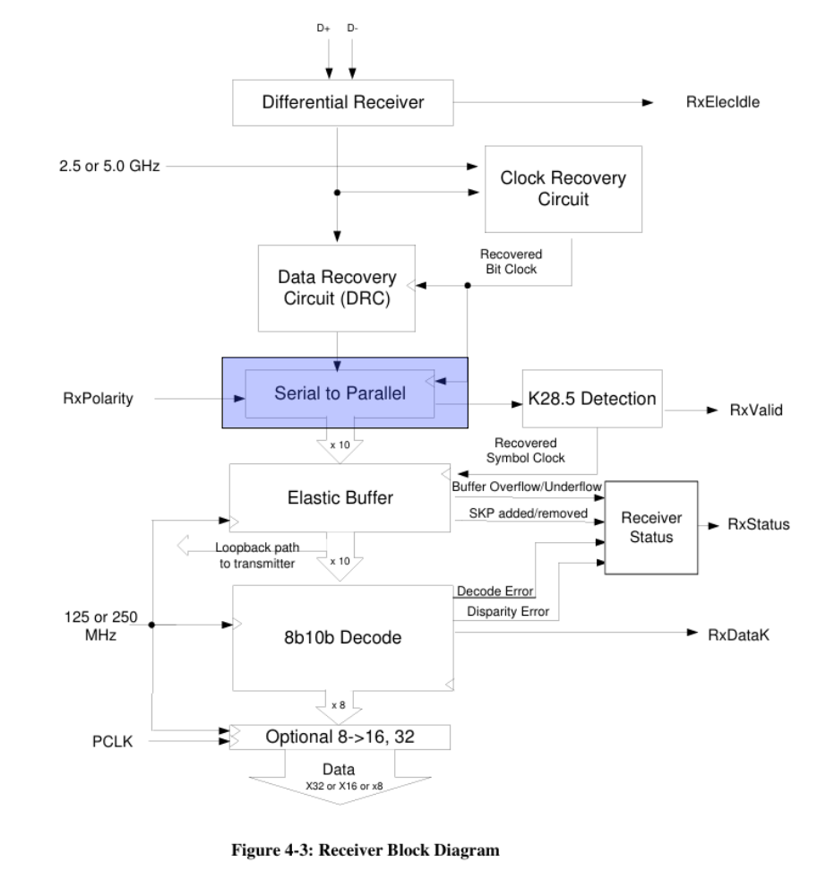
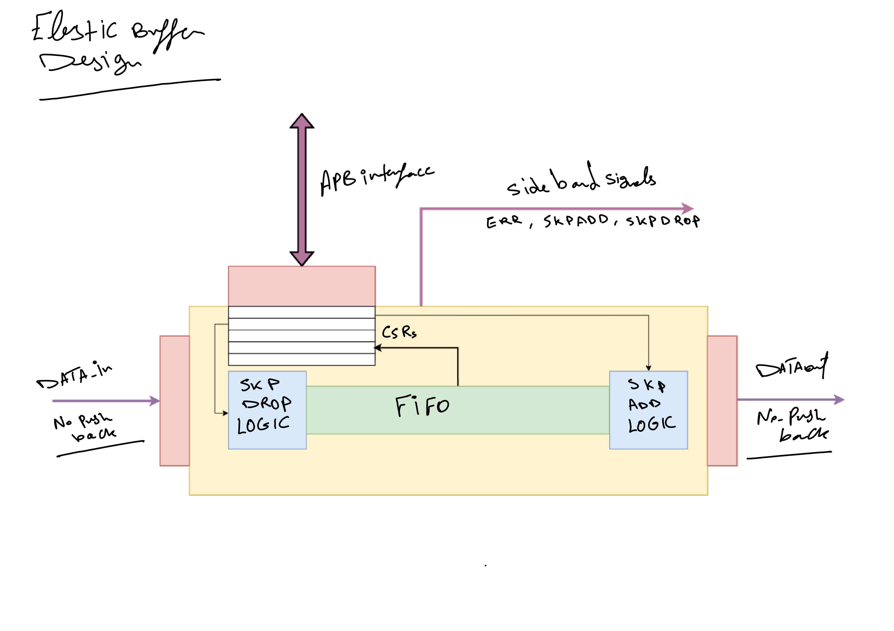
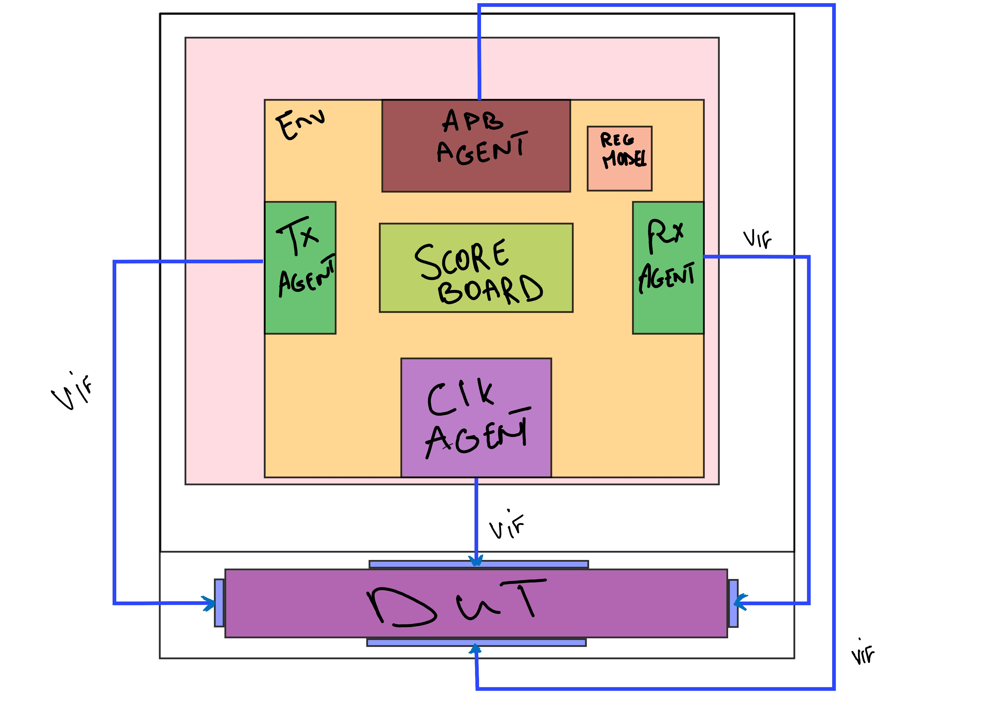
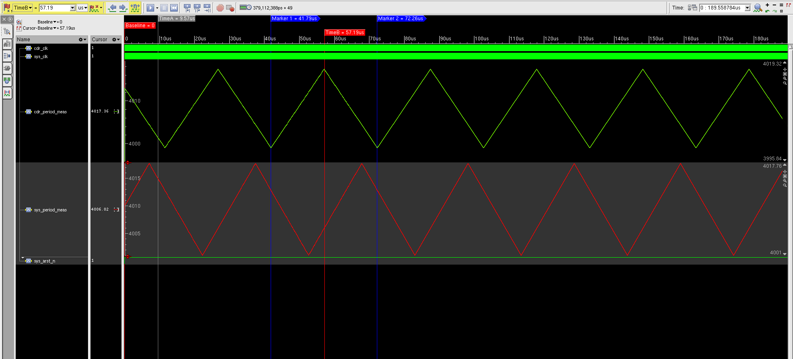

# Design and Verification of an Elastic Buffer

## Project Title and Objective
Design and Verification of an Elastic Buffer

This repository implements a SystemVerilog elastic buffer for rate matching between independent clock domains, with support for APB-based configuration and SKP symbol insert/drop control relevant to **USB 3.0 Gen1** style data paths. The project includes both synthesizable RTL and a UVM verification environment used to validate buffering correctness, register programmability, and protocol-oriented traffic scenarios.

## Architecture and Block Diagrams
The Elastic Buffer consists of the following components:
- **Asynchronous FIFO**
- **SKP DROP LOGIC**
- **SKP INSERT LOGIC**
- **APB Wrapper**

### Block Diagram

 

### Interfaces
- **APB Interface**: Used for configuration and control.
- **Read/Write Stream Interfaces**: Handle data input and output.

## Directory Structure
```
├── src/          # Synthesizable SystemVerilog source files
├── verf/         # Verification environment (UVM components, testbenches, etc.)
│   ├── apb_uvc/  # APB (Advanced Peripheral Bus) Universal Verification Component
│   ├── clk_uvc/  # Clock generation and synchronization component
│   ├── rd_uvc/   # Read stream data interface component
│   ├── wr_uvc/   # Write stream data interface component
│   ├── if/       # Interface definitions for all UVC components
│   ├── eb_env/   # Main Elastic Buffer verification environment
│   │   ├── sim/  # Test Logs
│   │   ├── cov_work/      # Coverage database for imc 
│   │   └── REGRESSION/    # Regression test automation Scripts
│   └── USB_3_GEN1_case.md  # USB 3.0 Gen1 use case documentation
├── scripts/      # TCL scripts and automation tools
├── docs/         # Documentation and diagrams
└── syn/          # Synthesis project files and reports
```

### Verification Environment (verf/) Overview


The verification environment is built from modular UVM components that coordinate to validate the Elastic Buffer design:

#### **Clock UVC** (`clk_uvc/`)
Generates multi-frequency clock signals to stress test clock domain crossing logic.
- **Key Features**: Configurable clock frequencies, and **Spread Spectrum Clock (SSC) generation** for USB 3.0 Gen1 compliance
- **Components**: Driver, monitor, sequencer, and coverage collector for comprehensive clock behavior validation



#### **APB UVC** (`apb_uvc/`)
Manages APB (Advanced Peripheral Bus) configuration and control transactions.
- **Key Features**: Full register model using **UVM RAL (Register Abstraction Layer)** with register verification framework (`reg_verifier_dir/`)
- **Components**: Driver, sequencer, monitor, and register model for register-level testing and coverage

#### **Write Stream UVC** (`wr_uvc/`)
Injects write data into the Elastic Buffer input interface.
- **Key Features**: Constrained-random and directed write sequence generation with configurable SKP injection and starving sequences

#### **Read Stream UVC** (`rd_uvc/`)
Monitors read data from the Elastic Buffer output interface.

#### **Elastic Buffer Environment** (`eb_env/`)
Integrates all UVCs and coordinates verification:
- **eb_env.sv**: Top-level environment orchestrating all UVC connections
- **eb_scoreboard.sv**: Self-checking component comparing expected vs. actual transactions
- **eb_coverage_collector.sv**: Aggregates functional and code coverage metrics
- **eb_test_lib.sv**: Test cases including `eb_usb_test`, `eb_counting_test`, `fifo_test`, `eb_wr_skp_test`, `eb_rd_skp_test`

#### **Regression Suite** (`eb_env/REGRESSION/`)
Automated testing and result aggregation framework:
- **run_regression.sh**: Executes all tests sequentially and logs results
- **Features**: Automatic test failure reporting, coverage merging, and result summary generation

## Tools Used
- **Simulation Tools**: Cadence Xcelium, IMC, and RegVerifier
- **Synthesis Tools**: Vivado 2023.1

## How to Run
From the repository root, use the top-level Makefile as the single entrypoint.

### Simulation
1. Run a single UVM test:
   ```bash
   make sim TEST=eb_usb_test SEED=1
   ```
2. Open SimVision GUI for a test run:
   ```bash
   make gui TEST=eb_usb_test SEED=1
   ```

#### Regression
1. Run full regression (delegates to `verf/eb_env/REGRESSION/Makefile`):
   ```bash
   make regression SEED=1
   ```
2. Run regression and automatically load merged coverage in IMC:
   ```bash
   make regression_gui SEED=1
   ```
3. Load the merged coverage database separately:
   ```bash
   make imc_load
   ```

### Synthesis
1. Run Zybo Z7-10 project synthesis from command line:
   ```bash
   make synth SYNTH_TOP=eb_top
   ```
   Outputs are written to `syn/vivado_zybo_z7_10/`.
2. Run quick RTL synthesis check (out-of-context):
   ```bash
   make vivado_check CHECK_TOP=elastic_buffer FPGA_PART=xc7z010clg400-1
   ```
   Reports are written to `syn/vivado_utilization.rpt` and `syn/vivado_timing.rpt`.

## Verification Strategy and Results

### Methodology
The verification environment employs a **UVM-based (Universal Verification Methodology)** approach coordinating five specialized UVCs:
- **Clock UVC**: Generates realistic clocks with SSC for multi-frequency CDC validation
- **APB UVC**: Configuration via register model with full RAL support
- **Write/Read Stream UVCs**: Data injection and extraction with backpressure scenarios
- **Scoreboard**: Self-checking mechanism flagging data corruption, dropped symbols, and protocol violations

### Running Verification
```bash
make sim TEST=eb_usb_test SEED=1
```
Results and waveforms are available in `verf/eb_env/sim/` and coverage reports in `verf/eb_env/cov_work/`.
